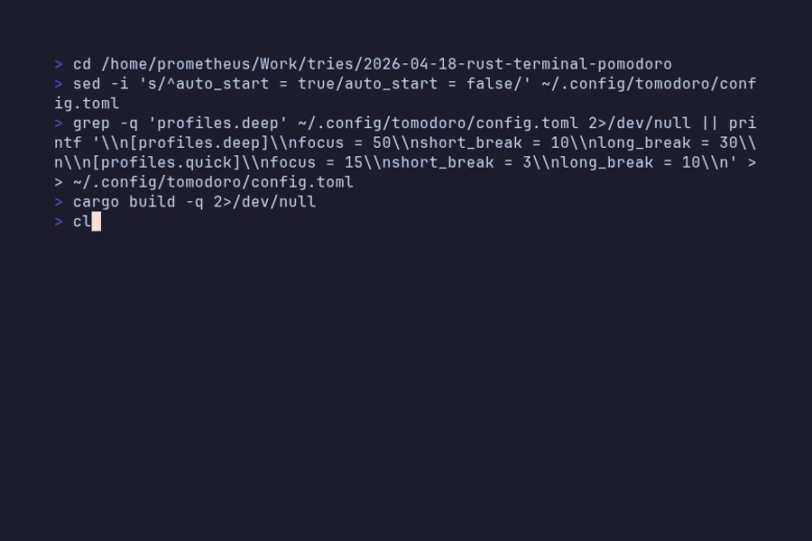

# tomodoro

A terminal Pomodoro timer with animated backgrounds.




[](https://crates.io/crates/tomodoro)

## Install

```sh
cargo install tomodoro
```

Requires Rust — install via [rustup](https://rustup.rs) if you don't have it.

## Usage

On launch, a setup screen lets you choose your focus and break durations. Use `Tab` to move between fields, `←`/`→` to select hours or minutes, and `↑`/`↓` to change the value — or just type a number directly. Press `Enter` to start, `Esc` to quit.

| Key | Action |
|-----|--------|
| `Space` | Start / pause |
| `n` | Skip to next phase |
| `r` | Restart current phase |
| `e` | Edit timer durations |
| `[` / `]` | Volume down / up |
| `←` / `→` | Cycle animation themes |
| `↑` / `↓` | Cycle render modes (Half → Quarter → Braille) |
| `?` | Toggle help overlay |
| `Esc` | Cancel edit / quit |
| `q` / `Ctrl+C` | Quit |

### CLI flags

```sh
tomodoro --help       # list flags and subcommands
tomodoro --version    # print version
tomodoro --endless    # endless animation mode (also -E)
```

### Endless mode

`tomodoro -E` runs the animated background full-screen with no timer, no session indicators, no progress bar, and no sounds — pure ambient display.

| Key | Action |
|-----|--------|
| `Space` | Pause / resume animation |
| `←` / `→` | Cycle animation themes |
| `↑` / `↓` | Cycle render modes |
| `q` / `Esc` / `Ctrl+C` | Quit |

## Features

- **Custom durations** — set focus, short break, and long break times on startup or mid-session with `e`; type values directly or use arrow keys
- **Volume control** — adjust bell and beep volume with `[`/`]`, displayed in the header
- **Session tracker** — dots in the top-right show progress toward a long break (every 4 sessions)
- **8 animated themes** — waves, rain, falling leaves, starfield, fireplace, aurora borealis, cherry blossom, sunset; all hand-crafted scenes with detailed foreground elements
- **3 render modes** — half-block, quarter-block, or braille; increasing pixel density per terminal cell
- **Coloured progress bar** — matches the current theme; uses braille dots in braille mode
- **Bell sounds** — single bell when a focus session ends; countdown beeps for the last 5 seconds of a break
- **Phase indicators** — `F` (focus), `B` (short break), `LB` (long break)
- **Endless mode** — `tomodoro -E` runs animations full-screen with no timer, sounds, or UI chrome; pure ambient display
- **Version management** — install and switch between old releases with `tomodoro install`, `list`, and `--use`

## Version management

Install a specific older version alongside the current one:

```sh
tomodoro install 0.2.2
```

This pulls that version from crates.io and stores it at `~/.local/share/tomodoro/0.2.2/bin/tomodoro`. It does not affect the current binary on your PATH.

List all installed versions:

```sh
tomodoro list
```

Run a specific version:

```sh
tomodoro --use 0.2.2
```

To remove an old version, delete its directory:

```sh
rm -rf ~/.local/share/tomodoro/0.2.2
```

## Requirements

- A terminal with true colour and Unicode support (Ghostty, Kitty, WezTerm, etc.)
- **Linux (Debian/Ubuntu/Mint):** `libasound2-dev` required for audio — install with `sudo apt install libasound2-dev`

## Contributing

Contributions welcome — see [CONTRIBUTING.md](CONTRIBUTING.md).
